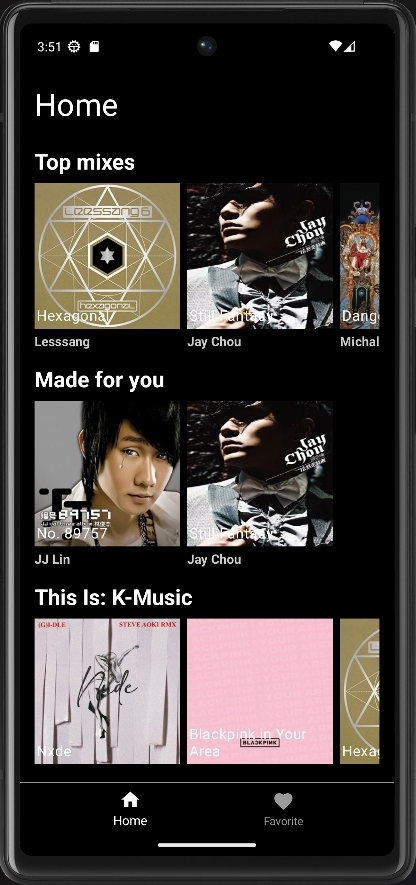

# Spotify Mobile App
## Project preview
(sc03.png)
## Architecture Diagram

The architecture consists of the following key components:

- **MainApplication**: The entry point of the application.
- **MainActivity**: Hosts the UI components and is responsible for handling the lifecycle of the app.

Within the `MainActivity`, we have:

- **FragmentContainerView**: Manages different fragments representing various sections of the app.

These fragments include:

- **HomeFragment**: Contains UI elements for the home screen.
- **FavoriteFragment**: Contains UI elements for the favorites screen.
- **PlaylistFragment**: Contains UI elements for the playlist screen.

Each fragment is backed by a corresponding ViewModel:

- **HomeViewModel**
- **FavoriteViewModel**
- **PlaylistViewModel**

Additionally, we have a **PlayerBar** with its own **PlayerViewModel** for music playback controls.

Repositories are responsible for data handling:

- **HomeRepository**
- **FavoriteAlbumRepository**
- **PlaylistRepository**

For data fetching and storage, the app uses:

- **Retrofit**: For network operations, potentially communicating with a mock server.
- **RoomDatabase**: For local data persistence.
- **Exoplayer**: For handling music playback functionality.

## Development Tool

In the context of this architecture, the following development topics are prioritized:

1. **Kotlin/Java**: The primary languages for Android development.
2. **MVVM/MVP/MVC**: Architectural patterns for structuring the app.
3. **Compose/Traditional XML**: UI development approaches with Jetpack Compose or traditional XML layouts.
4. **Kotlin Coroutine/Java Rxjava, ThreadPool, AsyncTask**: Concurrency and asynchronous tasks handling.
5. **Hilt dependency injection/Dagger**: For dependency management in the app.
6. **Retrofit**: Utilized for network requests with a mock server for testing.
7. **Room Database**: For managing local database operations.
8. **Image Libraries**: Handling images with libraries like Compose AsyncImage, Picasso, Glide, Fresco.
9. **Exoplayer**: For implementing audio playback features.

Each topic is crucial for the development and maintenance of the app's robust and scalable architecture.
